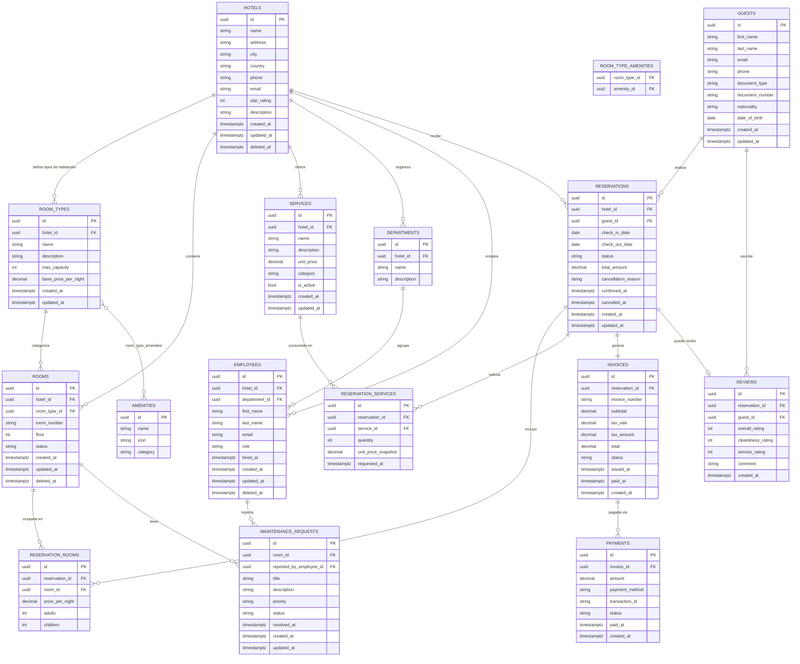

# Diagram viewer

```mermaid

erDiagram

    HOTELS {
        uuid id PK
        string name
        string address
        string city
        string country
        string phone
        string email
        int star_rating
        string description
        timestamptz created_at
        timestamptz updated_at
        timestamptz deleted_at
    }

    ROOM_TYPES {
        uuid id PK
        uuid hotel_id FK
        string name
        string description
        int max_capacity
        decimal base_price_per_night
        timestamptz created_at
        timestamptz updated_at
    }

    ROOMS {
        uuid id PK
        uuid hotel_id FK
        uuid room_type_id FK
        string room_number
        int floor
        string status
        timestamptz created_at
        timestamptz updated_at
        timestamptz deleted_at
    }

    AMENITIES {
        uuid id PK
        string name
        string icon
        string category
    }

    ROOM_TYPE_AMENITIES {
        uuid room_type_id FK
        uuid amenity_id FK
    }

    GUESTS {
        uuid id PK
        string first_name
        string last_name
        string email
        string phone
        string document_type
        string document_number
        string nationality
        date date_of_birth
        timestamptz created_at
        timestamptz updated_at
    }

    RESERVATIONS {
        uuid id PK
        uuid hotel_id FK
        uuid guest_id FK
        date check_in_date
        date check_out_date
        string status
        decimal total_amount
        string cancellation_reason
        timestamptz confirmed_at
        timestamptz cancelled_at
        timestamptz created_at
        timestamptz updated_at
    }

    RESERVATION_ROOMS {
        uuid id PK
        uuid reservation_id FK
        uuid room_id FK
        decimal price_per_night
        int adults
        int children
    }

    SERVICES {
        uuid id PK
        uuid hotel_id FK
        string name
        string description
        decimal unit_price
        string category
        bool is_active
        timestamptz created_at
        timestamptz updated_at
    }

    RESERVATION_SERVICES {
        uuid id PK
        uuid reservation_id FK
        uuid service_id FK
        int quantity
        decimal unit_price_snapshot
        timestamptz requested_at
    }

    INVOICES {
        uuid id PK
        uuid reservation_id FK
        string invoice_number
        decimal subtotal
        decimal tax_rate
        decimal tax_amount
        decimal total
        string status
        timestamptz issued_at
        timestamptz paid_at
        timestamptz created_at
    }

    PAYMENTS {
        uuid id PK
        uuid invoice_id FK
        decimal amount
        string payment_method
        string transaction_id
        string status
        timestamptz paid_at
        timestamptz created_at
    }

    DEPARTMENTS {
        uuid id PK
        uuid hotel_id FK
        string name
        string description
    }

    EMPLOYEES {
        uuid id PK
        uuid hotel_id FK
        uuid department_id FK
        string first_name
        string last_name
        string email
        string role
        timestamptz hired_at
        timestamptz created_at
        timestamptz updated_at
        timestamptz deleted_at
    }

    MAINTENANCE_REQUESTS {
        uuid id PK
        uuid room_id FK
        uuid reported_by_employee_id FK
        string title
        string description
        string priority
        string status
        timestamptz resolved_at
        timestamptz created_at
        timestamptz updated_at
    }

    REVIEWS {
        uuid id PK
        uuid reservation_id FK
        uuid guest_id FK
        int overall_rating
        int cleanliness_rating
        int service_rating
        string comment
        timestamptz created_at
    }

    HOTELS ||--o{ ROOM_TYPES         : "define tipos de habitación"
    HOTELS ||--o{ ROOMS              : "contiene"
    HOTELS ||--o{ SERVICES           : "ofrece"
    HOTELS ||--o{ DEPARTMENTS        : "organiza"
    HOTELS ||--o{ EMPLOYEES          : "emplea"
    HOTELS ||--o{ RESERVATIONS       : "recibe"
    ROOM_TYPES ||--o{ ROOMS          : "categoriza"
    ROOM_TYPES }o--o{ AMENITIES      : "room_type_amenities"
    GUESTS ||--o{ RESERVATIONS       : "realiza"
    RESERVATIONS ||--o{ RESERVATION_ROOMS     : "incluye"
    RESERVATIONS ||--o{ RESERVATION_SERVICES  : "solicita"
    RESERVATIONS ||--|| INVOICES              : "genera"
    RESERVATIONS ||--o| REVIEWS               : "puede recibir"
    INVOICES ||--o{ PAYMENTS                  : "pagada via"
    ROOMS ||--o{ RESERVATION_ROOMS            : "ocupada en"
    ROOMS ||--o{ MAINTENANCE_REQUESTS         : "tiene"
    SERVICES ||--o{ RESERVATION_SERVICES      : "consumida en"
    DEPARTMENTS ||--o{ EMPLOYEES              : "agrupa"
    EMPLOYEES ||--o{ MAINTENANCE_REQUESTS     : "reporta"
    GUESTS ||--o{ REVIEWS                     : "escribe"


```